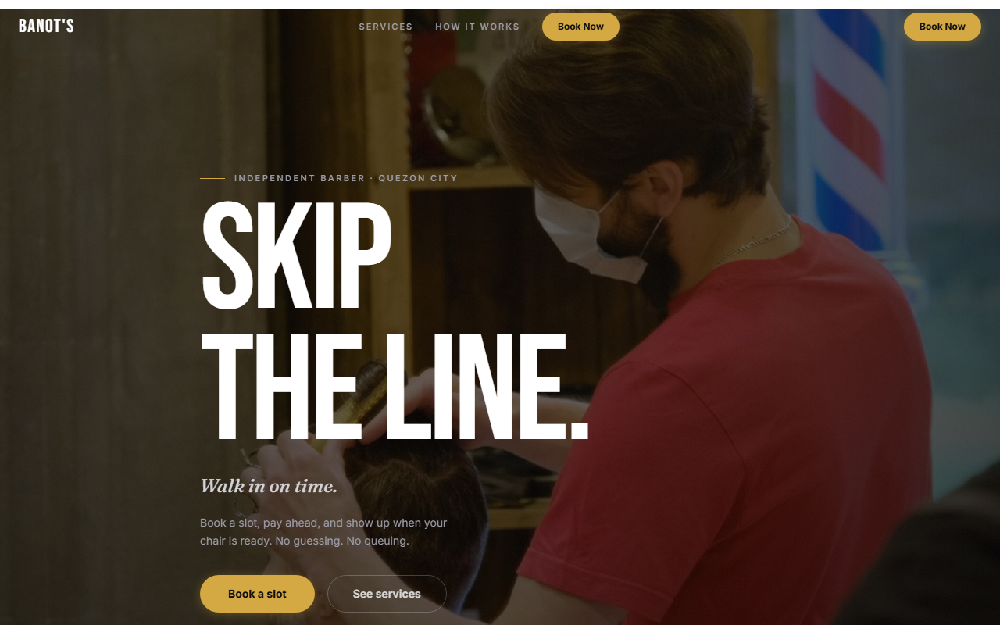
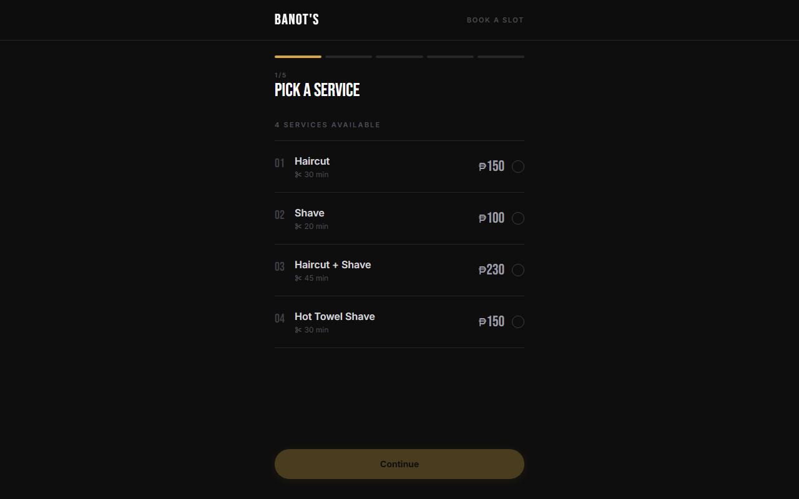
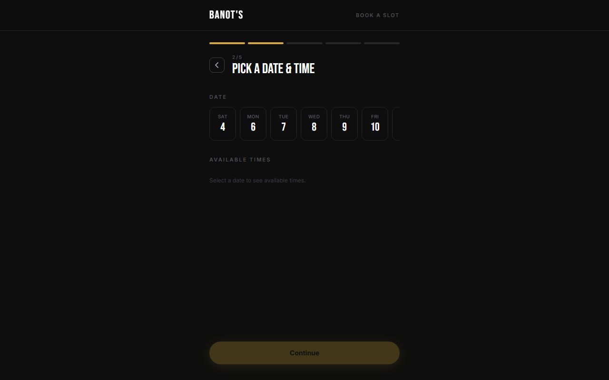

# Banot's Barbershop

A booking system for a one-chair barbershop. The owner cuts hair all day — he doesn't have time to be answering "are you free at 3?" messages between clients. So this lets people book themselves, and gives him a simple dashboard to run the day from.

**Live:** [banots-barbershop.vercel.app](https://banots-barbershop.vercel.app) — the booking flow is public; the dashboard is the owner's.



## How it works

A client goes to the booking page and walks through a short wizard: pick a service, pick a date and time, leave their name and number. Services run ₱100–₱230.

<table><tr>
<td></td>
<td></td>
</tr></table>

Payment is the part I spent the most time on. People here pay by GCash, Maya, GoTyme, or bank transfer — so after booking, the client uploads a screenshot of their payment as proof. The booking comes in as `pending_verification`, and the barber confirms it from his side once he sees the proof landed.

On the dashboard he can see:
- **Bookings** for the day
- **Pending** ones waiting on payment verification
- **Walk-ins** he can punch in directly (not everyone books online)
- **Clients** — a little history, including when they last came in
- **Settings** for services and payment details

## Stack

- **Next.js 16** + **React 19**, TypeScript
- **PostgreSQL** through **Prisma 7** (using the `pg` adapter)
- **Tailwind v4** for styling, **motion** for the booking-flow transitions
- **Playwright** for end-to-end tests

## Running locally

```bash
npm install
# set DATABASE_URL in .env
npx prisma migrate dev
npm run dev
```

The data model is small on purpose — two tables, `Client` and `Booking`. A booking holds the service, the price/duration snapshot, the date/time, where it came from (online vs walk-in), and the payment proof. Schema's in `prisma/schema.prisma`.
